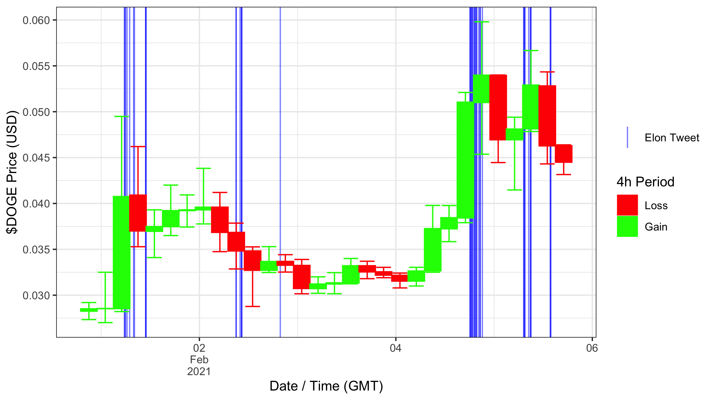

# elon_doge_tracker

Install the packages listed at the head of `gen_graph.R` file using `install.packages` in R, and use `Rscript gen_graph.R` to generate different time intervals of the graph.

More intervals are supported; for more information refer to the [Binance API documentation](https://github.com/binance/binance-spot-api-docs/blob/master/rest-api.md).

On the first run of `rtweet` a browser instance will launch to request API access via your Twitter account.

